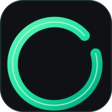

  
  <h1>TrackLess: Nicotine & Habit Tracker</h1>
  
<b>Quit Smoking, Snus & Nicotine Pouches — No Ads, 100% Offline & Private</b>

  

    <a href="#english">🇬🇧 English</a> • <a href="#русский">🇷🇺 Русский</a>
  

  
  

    
    
    
    
    
  

  
  
  
  
  

---

<h2 id="english">🇬🇧 English</h2>

**TrackLess** is a lightweight, ad-free Android application designed to help you track and reduce your consumption of **snus, nicotine pouches, and cigarettes**. Built with a focus on privacy and simplicity, it acts as a personal quit-smoking tracker and habit diary without relying on cloud services, subscriptions, or intrusive permissions.

### 🌟 Key Features
- **Abstinence Timer & Health Milestones:** Track the time passed since your last use and monitor real-time biological health recovery stages (from 20 minutes to 1 month).
- **Craving SOS (Urge Surfer):** Built-in 4-7-8 breathing guide to help you ride out intense cravings without relapsing.
- **Financial Savings Calculator:** Set a personal wishlist goal (e.g., a new gadget) and see how much money you've saved by cutting back on packs or portions.
- **Advanced Analytics:** Interactive 14-day history chart, circadian pattern breakdown (Morning/Day/Evening/Night), and context triggers (Stress, Coffee, Social, Habit).
- **Home-Screen Widgets:** 1x1 and 2x1 Android widgets for instant, one-tap logging directly from your home screen.
- **100% Offline & Private:** All data is stored locally on your device. Import/export your JSON data at any time. Zero ads, zero telemetry.

### 📱 UI & Screenshots
TrackLess features a sleek **Noble Apple Liquid Glass** interface with obsidian dark tones, translucent frosted glass cards, and smooth micro-interactions powered by native Android haptic feedback.

| ⏱️ Dashboard & Health | 📋 Daily Log & Widgets | 📊 14-Day Analytics |
| :---: | :---: | :---: |
|  |  |  |
| **Timer, SOS Button, & Goals** | **Limits, Tags, & History Feed** | **Bar Charts & Usage Patterns** |

### 🛠️ Background Story
I have no professional background in Android development. I created TrackLess for myself because I couldn't find a straightforward habit tracker on Google Play that wasn't bloated with ads or subscriptions. I relied heavily on ChatGPT for the architecture, UI design, and debugging. If you are an experienced developer and see room for improvement, constructive PRs and feedback are very welcome!

[Report a bug or request a feature](https://github.com/poorangryman/trackless-public/issues)

---

<h2 id="русский">🇷🇺 Русский</h2>

**TrackLess** — это легковесное Android-приложение без рекламы, созданное для трекинга и контроля употребления **снюса, никотиновых паков и сигарет**. Разработанное с упором на приватность и минимализм, оно работает как ваш личный дневник привычек и помощник в отказе от курения — без подписок, регистрации и облаков.

### 🌟 Главные возможности
- **Таймер воздержания и этапы здоровья:** Отслеживайте время с последнего употребления и наблюдайте за биологическим восстановлением организма (от 20 минут до 1 месяца).
- **Кнопка SOS (Urge Surfer):** Встроенный помощник с дыхательной практикой 4-7-8, чтобы пережить острые приступы тяги без срывов.
- **Финансовая копилка (Wishlist):** Задайте цель (например, новую приставку или кроссовки) и смотрите, как быстро вы копите на неё за счет сэкономленных на сигаретах или снюсе денег.
- **Детальная аналитика:** Горизонтальный интерактивный график за 14 дней, статистика по времени суток (утро, день, вечер, ночь) и теги причин (Стресс, Привычка, Кофе, Компания).
- **Виджеты для рабочего стола:** Удобные виджеты (1x1 и 2x1) для записи употребления в один клик прямо с главного экрана.
- **100% Оффлайн и Приватно:** Все данные хранятся только на вашем телефоне. Доступен экспорт/импорт в формате JSON. Никакой рекламы и сбора данных.

### 📱 Интерфейс и дизайн
В TrackLess используется темный интерфейс **Liquid Glass** — полупрозрачные стеклянные карточки на глубоком черном фоне (идеально для AMOLED-экранов), плавные анимации и тактильный виброотклик.

| 🎯 Персонализация и Лимиты | 💰 Экономика и Сбережения |
| :---: | :---: |
|  |  |
| **Двуязычный UI, настройка лимитов** | **Расчет реальной экономии** |

### 🛠️ История создания
Я не являюсь профессиональным Android-разработчиком. TrackLess был создан изначально для личного пользования, так как в Google Play не нашлось простого трекера без навязчивой рекламы и премиум-подписок. В процессе разработки, архитектуры и создания дизайна я активно использовал ChatGPT. Если вы опытный разработчик и видите способы улучшить код — буду рад вашим Pull Requests и советам!

[Сообщить об ошибке или предложить идею](https://github.com/poorangryman/trackless-public/issues)

---

### 📦 Building & Contribution (Сборка и участие)
- **IDE:** Android Studio
- **Language:** Kotlin (Jetpack Compose)
- **Build:** `assembleRelease` to build a production APK without a private key (suitable for testing).

We welcome contributions! Feel free to open issues, submit pull requests, or translate the app into your language.

### 📄 License
This project is licensed under the [MIT License](LICENSE).
