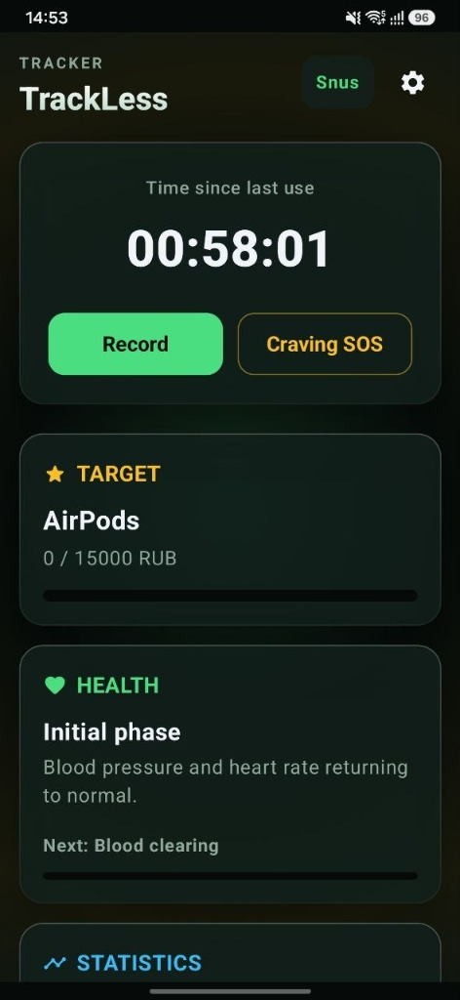
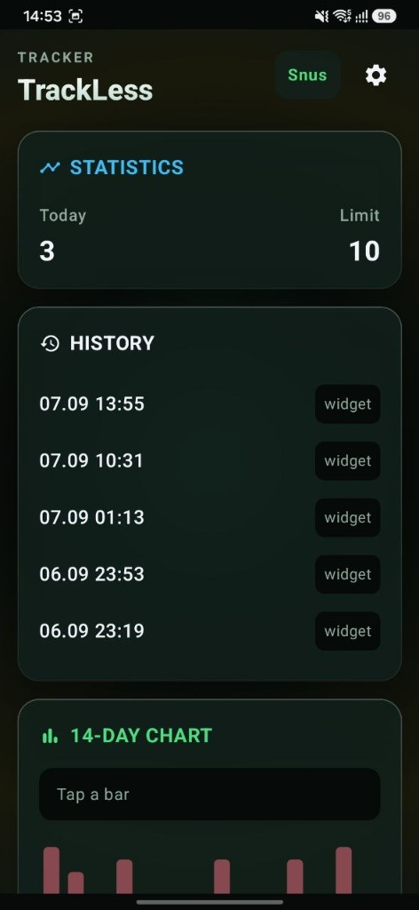
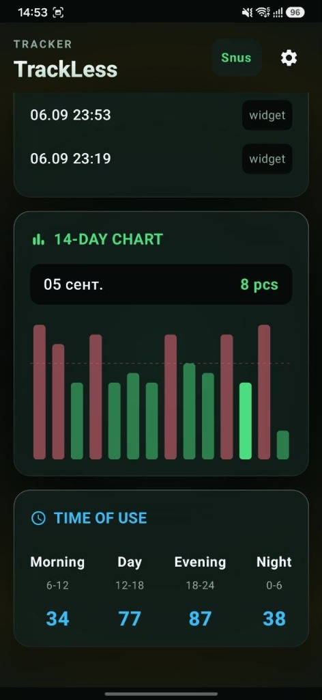
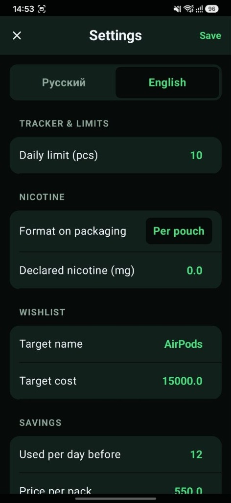
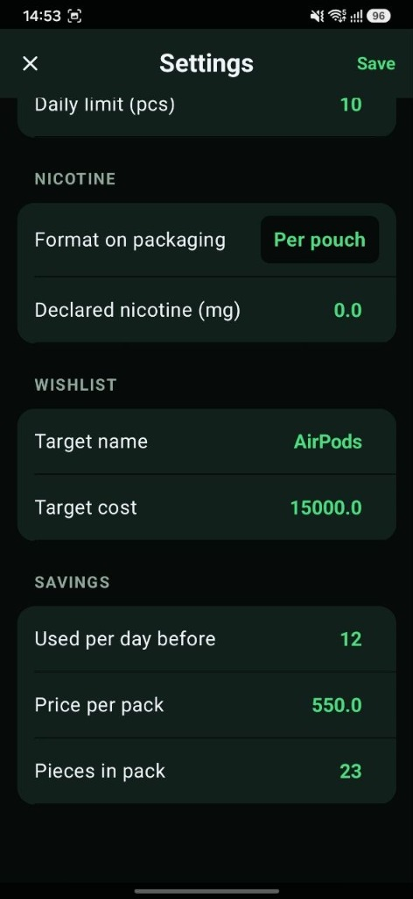

# TrackLess

  <strong>A modern, offline-first personal tracker for snus, nicotine pouches, and cigarettes — built with privacy, zero ads, and zero subscriptions.</strong>

  
  
  
  
  

  
  
  
  
  

---

I want to start by making one thing clear: **I have absolutely no professional experience in Android application development.**

TrackLess was created as a personal project for my own needs. I couldn't find a simple, reasonable tracker on the Google Play Store that didn't come with ads, unnecessary features, accounts, subscriptions, or other things I simply didn't need.

So I decided to make one myself.

And I relied **heavily on ChatGPT throughout the entire development process** — from the initial idea and project structure to implementation, debugging, UI improvements, and fixing various Android-specific issues. So if you're an experienced Android developer and wondering why something was implemented in a particular way... please be gentle.

I'm sharing the project publicly because I thought that someone else might find it useful too. If it helps even a few people track their habits without ads or unnecessary distractions, then publishing it was worth it.

## 📱 Interface & Screenshots

### Core Dashboard & Analytics

| ⏱️ Dashboard & Health | 📋 Daily Log & Widgets | 📊 14-Day Analytics & Patterns |
| :---: | :---: | :---: |
|  |  |  |
| **Abstinence timer**, Craving SOS urge surfer, Financial Target goal progress, and real-time biological **Health Recovery Milestones**. | **Today's usage vs daily limit**, live chronological history feed with **one-tap home screen widget logging** tags. | **Interactive 14-day bar chart** with limit threshold indicator and **Circadian Time of Use breakdown** (Morning, Day, Evening, Night). |

### Personalization & Savings Calculator

| ⚙️ Personalization & Limits | 💰 Pack Economics & Savings |
| :---: | :---: |
|  |  |
| **Bilingual interface (RU/EN)**, daily consumption limits, nicotine dosage format, and custom **Wishlist reward** target. | **Financial savings calculator**: baseline consumption, pack price, and portions to compute real money saved. |

---

## What is TrackLess?

TrackLess is a lightweight Android application for tracking **snus, nicotine pouch, and cigarette consumption**.

The idea is simple: record each use and let the application handle the statistics.

### Features

- Track individual snus/nicotine pouch and cigarette uses
- **Noble Apple Liquid Glass interface** with obsidian dark tones, translucent frosted glass cards, and fluid micro-interactions
- **SOS Craving Surfer & 4-7-8 Breathing Guide** to help overcome intense urge spikes without relapsing
- **Health Recovery Milestones Timeline** tracking biological body repair from 20 minutes to 1 month
- **Financial Wishlist ("Копилка на мечту")** calculating real-time progress toward personal reward goals using saved money
- **Context Trigger Tagging** (Stress, Habit, After Meal, Coffee, Boredom, Social) to understand consumption drivers
- **Hourly Pattern Breakdown** to visualize peak usage times throughout the day
- **Native Android Haptic Feedback** for tactile button presses and breathing pulses
- Record product type and relevant consumption details
- View consumption history and interactive 14-day bar chart
- Track daily and historical consumption statistics
- Monitor changes in consumption over time
- Track spending and money saved based on configured prices
- Track time since the last recorded use
- Home-screen widgets (1x1 and 2x1) for quick glance and one-tap logging
- Import and export application data (JSON)
- 100% local data storage on device
- No mandatory account or cloud service
- No advertising or telemetry

TrackLess is intentionally designed to stay relatively simple. It is not intended to replace medical advice, smoking-cessation treatment, or professional healthcare.

## Why does it exist?

I wanted a tool that would simply help me **see what I was actually consuming**, without turning the process into another subscription-based service or filling the interface with advertisements.

That's basically the whole idea behind TrackLess.

## Community feedback and contributions

If you use TrackLess, **feedback, bug reports, feature requests, and contributions are welcome**.

- [Report a bug or discuss TrackLess](https://github.com/poorangryman/trackless-public/issues/1)
- [Open a new issue](https://github.com/poorangryman/trackless-public/issues/new)

For bug reports, please include your Android version, device model, TrackLess version, steps to reproduce the problem, and screenshots or logs when possible.

If you are an Android developer, or have experience with Kotlin/Java, testing, security, architecture, or UI/UX, constructive suggestions and pull requests are especially welcome.

## A note about the code

This project is my first serious attempt at creating an Android application, and I am learning as I go.

**ChatGPT was heavily involved in the development of TrackLess.** The application would not have reached its current state without it.

I am publishing the source code openly because I believe that sharing a real, imperfect project can be more useful than pretending it was written by an experienced developer from the beginning.

If you're an experienced Android developer and notice something that could be significantly improved, constructive feedback is welcome.

**I'm also very open to suggestions and contributions from the community.** If you have ideas for new features, improvements, bug fixes, UI/UX changes, or anything else that could make TrackLess better, feel free to share them.

If you have experience with Android development, Kotlin/Java, UI/UX, testing, security, or any other area relevant to the project, **any help, advice, constructive criticism, or contribution would be greatly appreciated.** I'm still learning, so there is definitely a lot I can improve.

**I also used ChatGPT to write and polish this README.** My English isn't good enough to express all of this clearly and naturally on my own, so I relied on ChatGPT to help translate and formulate my thoughts. The ideas and information about the project are mine; ChatGPT helped me put them into proper English.

## Building

Open the project in Android Studio and run it on an Android device or emulator.

For a release build without a private signing key, run the Gradle `assembleRelease` task. The resulting APK is suitable for testing. A production release key can be supplied through environment variables without committing it to the repository.

## License

See [LICENSE](LICENSE).
